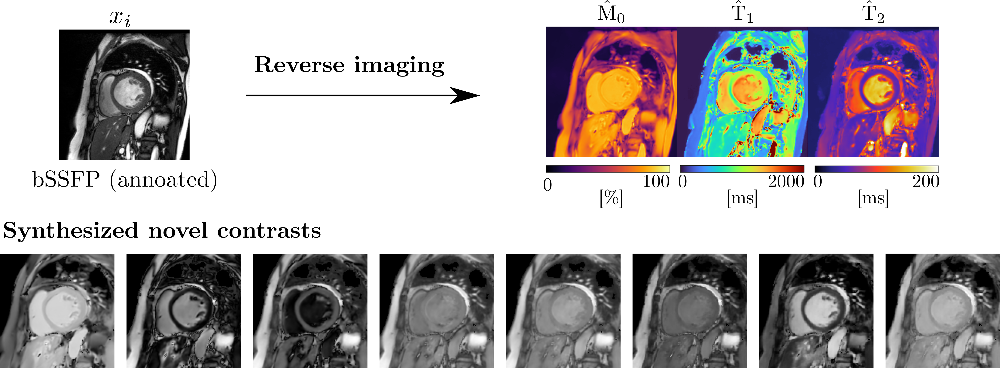

# Reverse Imaging in Cardiac Magnetic Resonance Imaging

In MRI, images acquired with different RF pulses are manefestations of the same underlying tissue properties including magnetization strength $\mathrm{M}_0$, $\mathrm{T}_1$, $\mathrm{T}_2$. ***Reverse imaging*** estimates the underlying physical properties of tissues that have caused the observed images, from qualitative images such as bSSFP cine. The physical properties can be used for physics-grounded cross-sequence synthesis and data augmentation in training segmentation models.

*We note that only the 128x128 resolution reverse imaging has been published. High resolution reverse imaging models and results as shown in the figure will be open-sourced later.*
## 0. Installation 
1. Clone the repository recursively. 
```bash
git clone --recurse-submodules https://github.com/Ido-zh/cmr_reverse.git
```

2. Create a venv using the requirements.txt
```bash 
python3 -m venv revimg
source revimg/bin/activate
pip install -r requirements.txt
```

3. Install the [modified nnUNet](https://github.com/Ido-zh/nnUNet-phys-seg) based on [nnUNetV1](https://github.com/MIC-DKFZ/nnUNet/tree/nnunetv1).
```bash 
cd nnunet
pip install -e .
```
Set the environmental variables required:

```bash
export nnUNet_raw_data_base="/path/to/nnunetdata/raw"
export nnUNet_preprocessed="/path/to/nnunetdata/preprocessed"
export RESULTS_FOLDER="/path/to/nnunetdata/results"
```


## 1. Download weights and required data.
Please make sure the environmental variables in nnUNet has been properly set. 
```bash
bash download_ddpm.sh
bash download_nnunet_trainingdata.sh
bash download_nnunet_weights.sh
```

## 2. Cookbook
### 1.1 Perform reverse imaging on the ACDC training split.
```bash
python cine_reverse_all.py  
```

### 1.2 Segmentation inference with the trained nnUNets.
t.b.a

